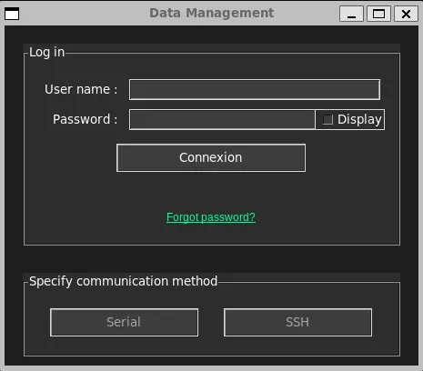
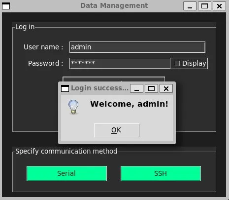
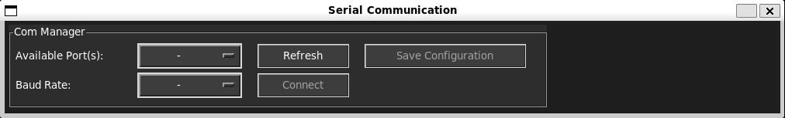
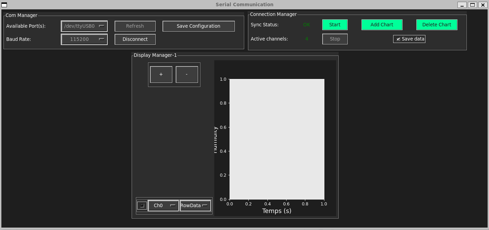
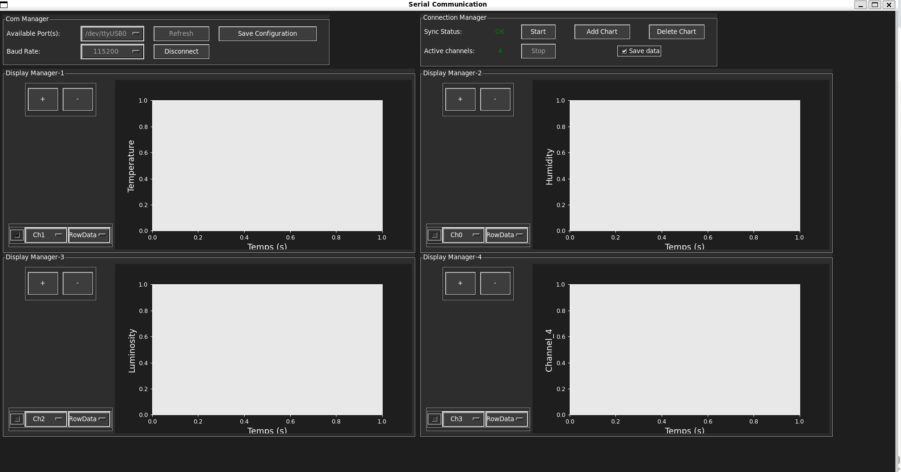
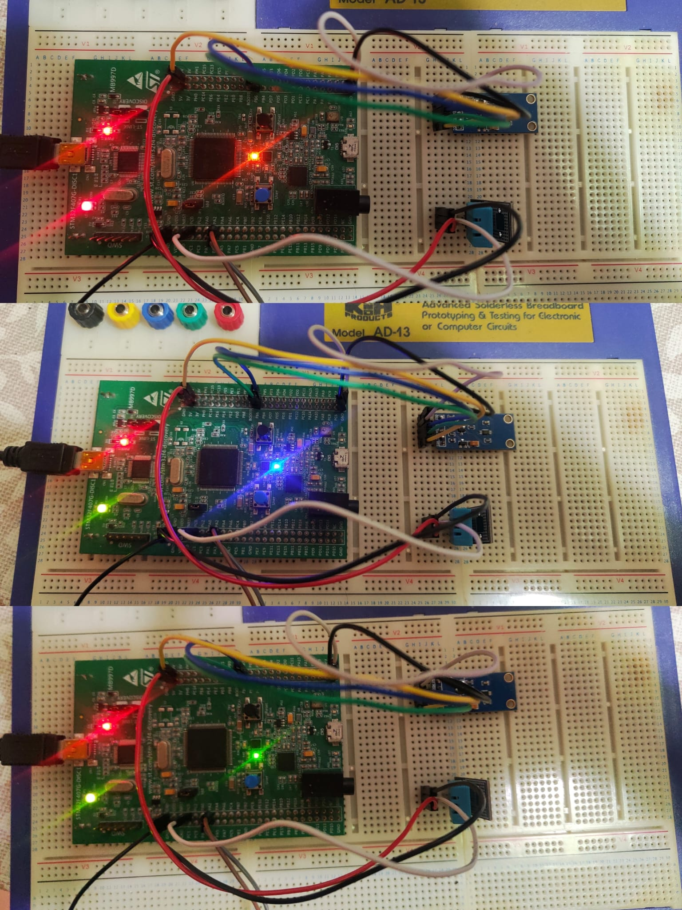
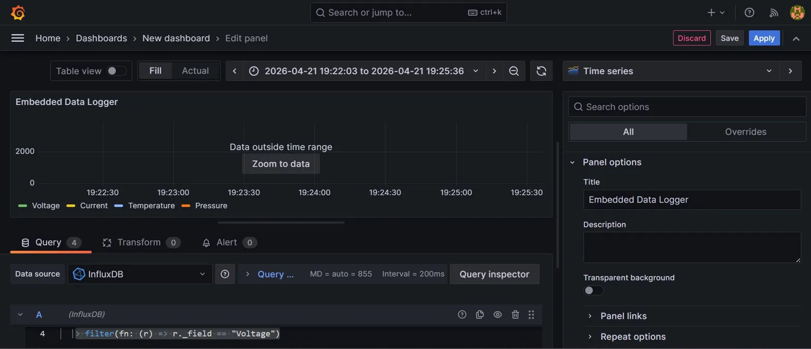
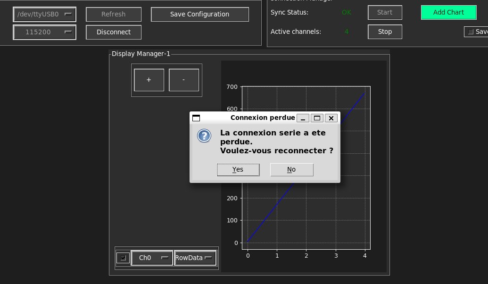

<div align="center">

# embedded-data-logger


Système embarqué de **collecte, visualisation et stockage cloud**
de données en temps réel via UART.

</div>


---

## Description

**embedded-data-logger** est un système embarqué complet permettant de :

- Collecter des données depuis une carte **STM32F407VG-Discovery** via **UART**
- Mesurer la **température** et l'**humidité** via le capteur **DHT11**
- Mesurer l'**intensité lumineuse** via le capteur **BH1750FVI**
- Visualiser les données en **temps réel** via une interface graphique Python
- Sauvegarder les données localement en **CSV**
- Stocker et visualiser les données dans le **cloud** via InfluxDB + Grafana

---

## Capteurs intégrés

| Capteur | Mesure | Broche | Protocole |
|---------|--------|--------|-----------|
| **DHT11** | Température + Humidité | PC0 | 1-Wire |
| **BH1750FVI** | Luminosité (lux) | PB6/PB7 | I2C |

## Architecture globale

```
┌─────────────────────┐        UART 115200 baud       ┌──────────────────────┐
│  STM32F407VG-Disco  │ ────────────────────────────► │      PC Linux        │
│                     │    #D#v1#v2#v3#v4#v5#\n       │   Python GUI Tkinter │
│  - GPIO LEDs        │                               │                      │
│  - UART USART2      │                               │  ┌────────────────┐  │
│  - SysTick          │                               │  │ Affichage      │  │
│  - IWDG Watchdog    │                               │  │ temps reel     │  │
└─────────────────────┘                               │  ├────────────────┤  │
                                                      │  │ Sauvegarde CSV │  │
       firmware/                                      │  ├────────────────┤  │
                                                      │  │ Envoi InfluxDB │  │
                                                      │  └────────────────┘  │
                                                      └──────────┬───────────┘
                                                                 │
                                                                 ▼
                                                      ┌──────────────────────┐
                                                      │  InfluxDB            │
                                                      │  (time-series DB)    │
                                                      └──────────┬───────────┘
                                                                 │
                                                                 ▼
                                                      ┌──────────────────────┐
                                                      │  Grafana Dashboard   │
                                                      │  localhost:3000      │
                                                      └──────────────────────┘
```


---

## Structure du dépôt

```
embedded-data-logger/
│
├── firmware/                          # Firmware STM32 (C, Makefile)
│   ├── src/
│   │   ├── main.c                     # Machine a etats UART + LEDs
│   │   ├── uart.c                     # Driver UART USART2
│   │   ├── gpio.c                     # Driver GPIO LEDs
│   │   ├── systick.c                  # Timer SysTick + delay_ms()
│   │   ├── iwdg.c                     # Driver Watchdog IWDG
│   │   └── system_stm32f4xx.c         # SystemInit (FPU + VTOR)
│   ├── include/                       # Fichiers d'en-tete (.h)
│   ├── startup/
│   │   └── startup_stm32f407.s        # Table des vecteurs + Reset_Handler
│   ├── linker/
│   │   └── STM32F407VGTx.ld           # Script de linkage (FLASH 1024K / RAM 192K)
│   ├── Makefile                       # Build GCC + OpenOCD + GDB
│   └── openocd.cfg                    # Configuration ST-Link SWD
│
├── gui/                               # Interface graphique Python
│   ├── src/
│   │   ├── Master.py                  # Point d'entree
│   │   ├── GUI_Master.py              # Interface Tkinter (dark theme)
│   │   ├── Serial_Com_Control.py      # Communication serie UART
│   │   ├── Data_communication_Control.py  # Traitement donnees
│   │   ├── influx_client.py           # Client InfluxDB
│   │   └── logger_config.py           # Configuration logging
│   ├── config/
│   │   ├── com_config.json.example    # Configuration port serie
│   │   └── users.json.example         # Template utilisateurs
│   ├── logs/                          # Fichiers CSV + logs (ignores par Git)
│   ├── tests/                         # Tests unitaires
│   └── requirements.txt              # Dependances Python
│
├── docker/
│   └── docker-compose.yml             # Stack InfluxDB + Grafana
│
├── docs/
│   └── protocol.md                    # Documentation protocole UART
│
├── .gitlab-ci.yml                     # Pipeline CI/CD
└── README.md
```


---

## Prérequis

### Matériel
| Composant | Description |
|-----------|-------------|
| STM32F407VG-Discovery | Carte de développement |
| Câble USB | Connexion ST-Link + UART |
| PC Linux / WSL | Ubuntu 22.04 recommandé |

### Logiciels
| Outil | Installation |
|-------|-------------|
| arm-none-eabi-gcc | `sudo apt install gcc-arm-none-eabi` |
| OpenOCD | `sudo apt install openocd` |
| make | `sudo apt install make` |
| Python 3.10+ | `sudo apt install python3` |
| Docker | `sudo apt install docker.io docker-compose` |

---

## Installation

### 1. Cloner le dépôt

```bash
git clone https://gitlab.com/z_benakka193/embedded-data-logger.git
cd embedded-data-logger
```

### 2. Firmware STM32

```bash
cd firmware

# Compiler
make

# Flasher la carte
make flash
```

### 3. Interface graphique Python

```bash
cd gui

# Installer les dependances
pip3 install -r requirements.txt

# Copier les fichiers de configuration
cp config/com_config.json.example config/com_config.json
cp config/users.json.example      config/users.json
```

### 4. Stack Cloud (InfluxDB + Grafana)

```bash
cd docker

# Lancer les conteneurs
sudo docker-compose up -d

# Vérifier
sudo docker ps
```

| Service | URL | Login |
|---------|-----|-------|
| InfluxDB | http://localhost:8086 | admin / admin1234 |
| Grafana  | http://localhost:3000 | admin / admin1234 |


---

## Guide d'utilisation

### 1. Lancement de l'application

```bash
cd gui/src
python3 Master.py
```

### 2. Authentification



Connectez-vous avec vos identifiants définis dans `gui/config/users.json` :

| Champ | Valeur par défaut |
|-------|------------------|
| User name | `admin` |
| Password | défini dans users.json |



### 3. Sélection du mode de communication

Après login réussi, cliquez sur **Serial** pour ouvrir l'interface de communication série.

### 4. Connexion série



| Etape | Action |
|-------|--------|
| 1 | Sélectionnez le port (`/dev/ttyUSB0` ou `/dev/ttyACM0`) |
| 2 | Sélectionnez le baudrate (`115200`) |
| 3 | Cliquez **Connect** |
| 4 | Attendez **Sync Status : OK** et **Active channels : 4** |

### 5. Démarrage du streaming



- Cliquez **Start** pour démarrer la réception des données
- Les courbes s'affichent en temps réel sur le graphique
- Cochez **Save data** pour sauvegarder en CSV et envoyer vers InfluxDB

### 6. Gestion des graphiques



| Bouton | Action |
|--------|--------|
| **Add Chart** | Ajoute un nouveau graphique |
| **Delete Chart** | Supprime le dernier graphique |
| **+** | Ajoute un canal sur le graphique |
| **-** | Supprime un canal du graphique |

> Maximum **4 graphiques** simultanés

### 7. Indicateurs LED STM32



| LED | Etat | Description |
|-----|------|-------------|
| Orange | WAIT_SYNC | En attente de connexion PC |
| Bleue | IDLE | Connecte, stream arrete |
| Verte | STREAMING | Envoi des donnees actif |
| Rouge | default | Erreur / etat inconnu |

### 8. Dashboard Grafana



Ouvrez `http://localhost:3000` dans votre navigateur :
- Login : `admin` / `admin1234`
- Dashboard : **Embedded Data Logger**
- Les 4 canaux sont visibles en temps reel

### 9. Reconnexion automatique

En cas de deconnexion USB, une popup apparait automatiquement :
- Cliquez **Yes** pour tenter la reconnexion (5 tentatives, 2s de delai)
- Cliquez **No** pour annuler




---

### 10. Données CSV enregistrées

Les fichiers CSV sont sauvegardés automatiquement dans `gui/logs/`
avec un nom horodaté :
gui/logs/
└── 20260422005625.csv   ← YYYYMMDDHHMMSS.csv

#### Format des données
timestamp,Voltage,Current,Temperature,Pressure
0.0,4,1996,1282,3500
0.0175,6,1994,1282,3500
0.0319,8,1992,1282,3500
0.0345,10,1990,1282,3500
...

| Colonne | Description | Unité |
|---------|-------------|-------|
| `timestamp` | Temps relatif depuis le debut du stream | secondes |
| `Voltage` | Canal 0 — increment 0 → 2000 | valeur ADC |
| `Current` | Canal 1 — decrement 2000 → 0 | valeur ADC |
| `Temperature` | Canal 2 — valeur fixe 1282 | valeur ADC |
| `Pressure` | Canal 3 — valeur fixe 3500 | valeur ADC |

> Le dossier `gui/logs/` est ignore par Git (`.gitignore`).


---


## Protocole de communication UART

### Paramètres de la liaison série

| Paramètre       | Valeur                  |
|-----------------|-------------------------|
| Interface       | USART2 (PA2=TX, PA3=RX) |
| Baudrate        | 115200                  |
| Bits de données | 8                       |
| Parité          | Aucune                  |
| Bits de stop    | 1                       |
| Reception       | Non bloquant (polling)  |

---

### Machine à états STM32
          '?'                    'A'
WAIT_SYNC ──────────────► IDLE ──────────────► STREAMING
▲                       │  ▲                    │
│          'P'          │  │       'S'          │
└───────────────────────┘  └────────────────────┘
'P'

| Etat | LED | Description |
|------|-----|-------------|
| `WAIT_SYNC` | Orange | Attente de la commande de synchronisation |
| `IDLE` | Bleue | Connecte, stream arrete |
| `STREAMING` | Verte | Envoi periodique des donnees |
| `default` | Rouge | Erreur / etat inconnu |

---

### Commandes PC → STM32

| Commande | Trame | Description |
|----------|-------|-------------|
| Sync | `#?#\n` | Demande de synchronisation |
| Start | `#A#\n` | Demarrage du flux de donnees |
| Stop | `#S#\n` | Arret du flux de donnees |
| Disconnect | `#P#\n` | Deconnexion |

---

### Reponses STM32 → PC

| Situation | Trame | Description |
|-----------|-------|-------------|
| Sync OK | `#!#4#\r\n` | Sync reussie — 4 canaux actifs |
| Donnees | `#D#v1#v2#v3#v4#v5#\n` | Trame de donnees |
| Stop OK | `#STOP#\r\n` | Stream arrete |
| Disconnect | `#DISCONNECTED#\r\n` | Deconnexion confirmee |
| Erreur | `#E#OVF#\n` | Depassement buffer TX |

---

### Format de la trame de données
#D#val1#val2#val3#val4#val5#\n

| Champ | Description |
|-------|-------------|
| `D` | Marqueur de trame de donnees |
| `val1` | Canal 0 — Voltage |
| `val2` | Canal 1 — Current |
| `val3` | Canal 2 — Temperature |
| `val4` | Canal 3 — Pressure |
| `val5` | Controle integrite = somme des chiffres decimaux |

#### Exemple
#D#206#157#1282#7677#14#\n
val5 = len("206") + len("157") + len("1282") + len("7677")
= 3 + 3 + 4 + 4
= 14

> Documentation complète : [`docs/protocol.md`](docs/protocol.md)